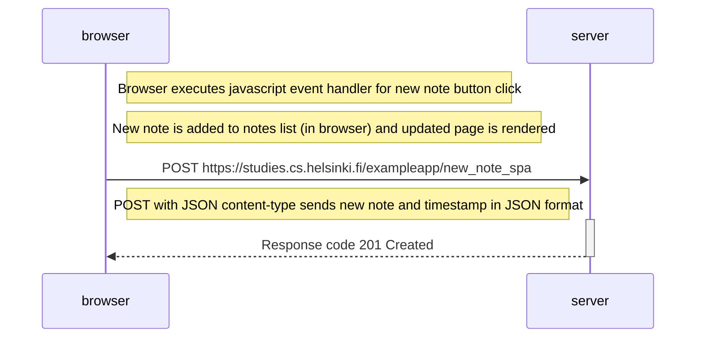

# Exercise 0.6

```mermaid
sequenceDiagram
    participant browser
    participant server
    
    Note right of browser: Browser executes javascript event handler for new note button click

    Note right of browser: New note is added to notes list (in browser) and updated page is rendered

    browser->>server: POST https://studies.cs.helsinki.fi/exampleapp/new_note_spa

    Note right of browser: POST with JSON content-type sends new note and timestamp in JSON format

    activate server
    server-->>browser: Response code 201 Created
    deactivate server

```
